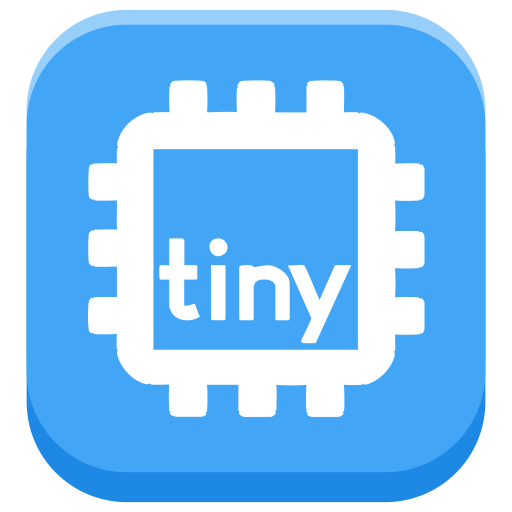

<div align="center">



**Write and flash embedded code, design circuits, and build visuals, all in one place**

[](LICENSE)
[](https://www.electronjs.org/)
[](https://react.dev/)
[](https://www.typescriptlang.org/)

</div>

---

> ### ⚠️ Alpha
>
> tinyStudio is in alpha. It works, but expect rough edges, and expect things to
> change between versions. See [Known issues](#known-issues) and
> [Roadmap](#roadmap) for where things stand, and [CHANGELOG.md](CHANGELOG.md)
> for what changed.

tinyStudio is an open-source IDE for makers. Write an Arduino sketch, upload it,
see the wiring next to it, and watch a p5.js sketch react to the board's serial
output, without jumping between apps. It runs as a desktop app (Electron) and in
the browser.

It's built around the tinyBoards from
[MR.INDUSTRIES](https://github.com/Mister-Industries), starting with the
**tinyCore** (an ESP32‑S3 development board). It also speaks plain Arduino, so
most sketches and boards (an Arduino Uno, an ESP32) work too.

## What it does

- **Three views of one project.** Switch between Code, Circuit and Visual:
  - **Code** is a Monaco editor for `.ino` sketches, with completion, hover and
    live diagnostics from the Arduino language server on desktop.
  - **Circuit** edits `circuit.json`: a breadboard view, a schematic view of the
    same circuit, an electrical rule check, and SPICE simulation (ngspice) with
    plots and probes.
  - **Visual** runs a [p5.js](https://p5js.org/) sketch (`visual.js`) live off the
    board's serial output, and exports it as a standalone web page or publishes
    it to GitHub Pages.
- **Build and flash.** Compile and upload with a bundled
  [`arduino-cli`](https://arduino.github.io/arduino-cli/) through the tinyService
  backend, with board options, upload progress and a Serial Monitor. As Arduino
  tightens its licensing we plan to write our own service; until then, please
  read arduino-cli's licence to make sure you're fine with its terms.
- **Parts.** tinyBoards and Fritzing parts from the
  [tinyparts](https://github.com/Mister-Industries/tinyparts) repo, each with
  breadboard and schematic art. The app ships a snapshot and picks up changes on
  launch. You can edit parts or add your own.
- **GitHub.** Open any repo, copy an example into your own account with **Make it
  mine**, and push, pull and publish from the app.
- **Examples.** A searchable library from
  [tinyStudio-examples](https://github.com/Mister-Industries/tinyStudio-examples).
- **Studio AI (optional).** Bring your own Anthropic API key for an assistant that
  can read your project, circuit and serial output, and edit files with your
  permission.

## The tinyFamily

| Board         | Description                       |
| ------------- | --------------------------------- |
| `tinyCore`    | The main ESP32‑S3 microcontroller |
| `tinyGlow`    | Addressable RGB LED module        |
| `tinyProto`   | Prototyping / Breakout board      |
| `tinySpeak`   | Microphone and Speaker AI module  |
| `tinySniff`   | MEMS Gas Sensor Array             |
| `tinyDisplay` | Round LCD module                  |

These come from the `tinyboards` pack in
[tinyparts](https://github.com/Mister-Industries/tinyparts) and show up in the
Circuit view's parts palette.

## Getting started

### Prerequisites

- **Node.js 22** and npm.

`npm install` pulls the backend packages (`@mister-industries/tinyservice` and
`@mister-industries/shared`) from public npm. `arduino-cli` is downloaded into
`vendor/` the first time you run `npm run dev` or `npm run build`.

### Develop

```bash
npm install
npm run dev       # desktop app; starts tinyService for you
npm run dev:web   # browser build at http://localhost:5173
```

Compile, upload and serial all go through **tinyService**, a local WebSocket
server that wraps `arduino-cli`. The desktop app starts it on the first free port
from 3000. The browser build needs it running on the same computer: install it
from the
[tinyService releases](https://github.com/Mister-Industries/tinyService/releases/latest)
(the app offers the installer when it can't reach the backend). To use a
different address, set `localStorage["tinyservice.url"]`. More in
[INTEGRATION_GUIDE.md](INTEGRATION_GUIDE.md).

GitHub sign-in on desktop needs an OAuth app client id at build time; see
[docs/github-auth.md](docs/github-auth.md).

### Check

```bash
npm run typecheck
npm run lint
npm test
```

CI runs these, plus the web build, on every push to `main` and each version branch.

### Build

```bash
npm run build:win     # Windows installer
npm run build:mac     # macOS app
npm run build:linux   # AppImage, snap and deb
npm run build:web     # static web bundle in dist-web/
```

Windows packaging: [docs/packaging-windows.md](docs/packaging-windows.md). Hosting
the web build: [docs/web-deploy.md](docs/web-deploy.md).

## Example projects

Ready-to-open projects live in
[tinyStudio-examples](https://github.com/Mister-Industries/tinyStudio-examples) and
show up in the app's **Examples** tab. Open one, pick your board and port, and hit
**Verify** or **Upload**.

These come with a circuit and a live visual:

| Project                                                                                                              | What it shows                                                       |
| -------------------------------------------------------------------------------------------------------------------- | ------------------------------------------------------------------- |
| [Basic Blink Program](https://github.com/Mister-Industries/tinyStudio-examples/tree/main/basics/blink-basic)         | Blink an LED and mirror its state in the Visual view                |
| [Smooth Breathing Effect](https://github.com/Mister-Industries/tinyStudio-examples/tree/main/basics/blink-breathing) | PWM-fade an LED and chart the brightness curve live                 |
| [Qwiic Joystick](https://github.com/Mister-Industries/tinyStudio-examples/tree/main/basics/qwiic-joystick)           | Read a Qwiic joystick and play Asteroids or Pong in the Visual view |

A project is a folder laid out the way the Arduino IDE expects:

```
my-example/
  my-example.ino    ← the sketch; it shares the folder's name
  circuit.json      ← the circuit (Circuit view)
  visual.js         ← the p5.js sketch (Visual view)
  README.md         ← shown in the Docs panel
```

Older projects with a `diagram.json` get a **Convert** button in the Circuit
view; it writes `circuit.json` and keeps the original as `diagram.json.bak`.

## Extending the library

- **Parts and their art** live in
  [tinyparts](https://github.com/Mister-Industries/tinyparts), one folder per part
  with real `.svg` files you can edit in Illustrator:
  [docs/parts-and-art.md](docs/parts-and-art.md).
- **Example projects** are folders in tinyStudio-examples:
  [docs/extending-the-library.md](docs/extending-the-library.md).

## Architecture

```
src/
  main/       Electron main process: windows, file access, tinyService,
              GitHub sign-in, the desktop side of Studio AI
  preload/    the typed bridge between main and the renderer
  renderer/   the React app: Code, Circuit and Visual views, Redux store,
              parts, the Arduino service client
  shared/     code both processes use (the Studio AI agent, constants)
scripts/      arduino-cli and language-server fetchers, parts tools, tests
docs/         design notes and guides
```

Where to read more:

| Topic                              | Doc                                                                                                          |
| ---------------------------------- | ------------------------------------------------------------------------------------------------------------ |
| tinyService and the backend        | [INTEGRATION_GUIDE.md](INTEGRATION_GUIDE.md)                                                                 |
| The circuit editor                 | [docs/circuit-view-tech-spec.md](docs/circuit-view-tech-spec.md)                                             |
| Parts, packs and art               | [docs/parts-and-art.md](docs/parts-and-art.md), [docs/tinyparts-pack-setup.md](docs/tinyparts-pack-setup.md) |
| Where state lives                  | [docs/state-management.md](docs/state-management.md)                                                         |
| Code conventions                   | [docs/code-conventions.md](docs/code-conventions.md)                                                         |
| Opening and saving files           | [docs/file-editing-flow.md](docs/file-editing-flow.md)                                                       |
| GitHub sign-in                     | [docs/github-auth.md](docs/github-auth.md)                                                                   |
| What is planned for 0.4.0 and beta | [docs/release-plan.md](docs/release-plan.md), from [the September 2026 audit](docs/audit-2026-09.md)         |

## Known issues

- Desktop projects opened in an earlier version ask you to choose their folder once.

## Roadmap

Nothing here is final.

**Up next**

- Circuit export to KiCad and Wokwi
- GitHub sign-in in the browser build without a pasted token
- Signed installers and automatic updates
- Tutorials for using tinyStudio

**Further out**

- CircuitPython support

## Contributions

tinyStudio is in alpha and **not accepting external contributions** yet. Pull
requests are closed automatically and issues may be closed without review. Feel
free to **fork** and experiment.

## License

tinyStudio is licensed under the **GNU General Public License v3.0 (or later)**.
See [LICENSE](LICENSE), and [THIRD_PARTY_NOTICES.md](THIRD_PARTY_NOTICES.md) for the
work it includes.
