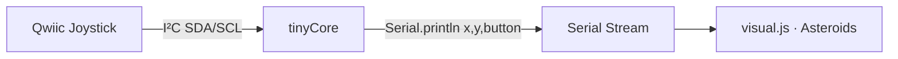

# 🕹️ Qwiic Joystick Asteroids

Stream the SparkFun Qwiic Joystick's X/Y position (and button) over serial, then **play a
full game of Asteroids** with it in the **Visual** tab.

Built with **tinyStudio** for the **tinyCore** ESP32-S3 board by MR.INDUSTRIES.

---

## What it does

- [x] Talks to the Qwiic Joystick over I²C (default address `0x20`)
- [x] Reads horizontal + vertical as 10-bit values (`0..1023`, center `~512`)
- [x] Streams `x,y,button` over serial as a simple CSV line
- [x] `visual.js` parses that stream and lets you **fly a ship, rotate, thrust, and shoot rocks**



---

## Hardware

The SparkFun Qwiic Joystick ([COM-15168](https://www.sparkfun.com/products/15168)) is an
I²C analog thumbstick. Plug it into the tinyCore **Qwiic** port with a Qwiic cable — no
soldering, no breadboard. (Qwiic carries `3V3 · GND · SDA · SCL`.)

Install the **SparkFun Qwiic Joystick Arduino Library** from the Library Manager.

---

## Serial format

One CSV line per sample, ~20 Hz:

```
512,498,0
```

`x , y , button` — where `x`/`y` are `0..1023` (center `~512`) and `button` is `1` while pressed.

---

## 📟 `qwiic_joystick.ino` — the firmware

This is the code that runs on the tinyCore. Its only job is to read the joystick and print
a clean CSV line that the visualizer can parse.

### Walkthrough

| Stage | What happens |
|-------|--------------|
| **Includes** | `Wire.h` for I²C and `SparkFun_Qwiic_Joystick_Arduino_Library.h` for the driver. A global `JOYSTICK joystick;` object handles all register reads. |
| **`setup()`** | Starts serial at `9600` baud, then brings up the I²C bus with `Wire.begin(3, 4)` — pins **3 (SDA)** and **4 (SCL)** are the tinyCore's Qwiic bus. |
| **Self-check** | `joystick.begin()` returns `false` if the device isn't found. If so, it prints a hint to check the Qwiic cable and halts in a `while (1)` loop so you're not left guessing. |
| **`loop()`** | Reads the three values and prints them as `x,y,button`, then `delay(50)` paces the stream to roughly 20 Hz. |

### Key lines

```cpp
int x = joystick.getHorizontal();             // 0..1023, center ~512
int y = joystick.getVertical();               // 0..1023, center ~512
int b = (joystick.getButton() == 0) ? 1 : 0;  // active-low → 1 = pressed
```

> **Note:** the joystick button is **active-low** (the library returns `0` when pressed),
> so the sketch inverts it to the more intuitive `1 = pressed` before sending.

---

## 🎮 `visual.js` — the Asteroids game

A p5.js sketch that turns the joystick stream into a playable game. It reads the **same CSV
format** the firmware emits, so the firmware and visualizer stay perfectly in sync.

### Controls

| Action | Joystick | Keyboard fallback* |
|--------|----------|--------------------|
| Rotate | Tilt **left / right** | ← / → arrows |
| Thrust | Push **up** | ↑ arrow |
| Fire | Press the **button** | Spacebar |
| Restart (after game over) | Press the **button** | Spacebar |

> \*If the tinyStudio serial harness isn't present (e.g. a plain browser), `visual.js`
> automatically falls back to the keyboard so you can test the game before wiring anything up.

### How the input is read

```js
// parse "x,y,button" -> {x, y, b}  (same regex the firmware feeds)
function parseLine(s) { ... }

// pull the latest line from the harness, or null when not connected
function readJoystick() {
  if (typeof serialRead !== 'function') return null;
  return parseLine(serialRead());
}
```

Each frame `handleInput()` grabs the newest joystick reading. A **deadzone** (`±90` around
center) ignores small wobble so the ship doesn't drift at rest, and a **rising-edge** check
on the button (`btn === 1 && lastBtn === 0`) means one press fires exactly one shot.

### Game architecture

| Piece | Role |
|-------|------|
| **`ship`** | Position, velocity, and angle. X tilt rotates it; pushing up adds thrust along its heading. Movement uses friction + a max-speed clamp, and the ship **wraps** around screen edges. |
| **`bullets`** | Spawned from the ship's nose, inherit ship velocity, and expire after `BULLET_LIFE` frames. |
| **`rocks`** | Lumpy procedurally-generated asteroids in three sizes. Large rocks split into two smaller ones when shot; small rocks just vanish. |
| **`checkCollisions()`** | Bullet-vs-rock (score + split) and ship-vs-rock (lose a life). Smaller rocks are worth more points. |
| **State** | `'play'` / `'over'`, with `lives`, `score`, a fire cooldown, and brief **invulnerability** (the blinking ship) after respawning. |
| **`nextWave()`** | Clearing all rocks spawns a new, slightly larger wave that scales with your score. |

### Tuning knobs

All the feel of the game lives in a block of constants near the top, so it's easy to tweak:

```js
const DEADZONE     = 90;    // ignore small wobble around center
const TURN_SPEED   = 0.07;  // radians per frame at full tilt
const THRUST_ACCEL = 0.12;
const FRICTION     = 0.99;
const MAX_SPEED    = 7;
const BULLET_SPEED = 7;
const FIRE_COOLDOWN = 10;   // frames between shots
const START_LIVES  = 3;
```

The palette constants (`C_BG`, `C_SHIP`, `C_ROCK`, `C_BULLET`) keep the firmware demo and the
game looking consistent.

---

## Build & play

1. **Verify** to compile the sketch.
2. **Upload** to your connected tinyCore.
3. Open the **Visual** tab — tilt to steer, push up to thrust, and press the button to shoot.
4. Clear every rock to advance to the next wave. Good luck! 🚀
