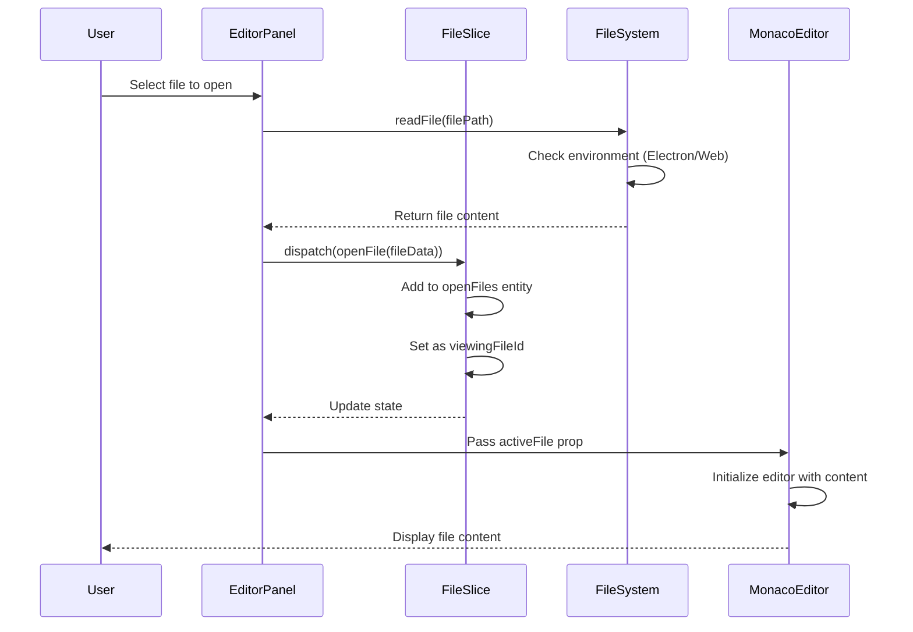
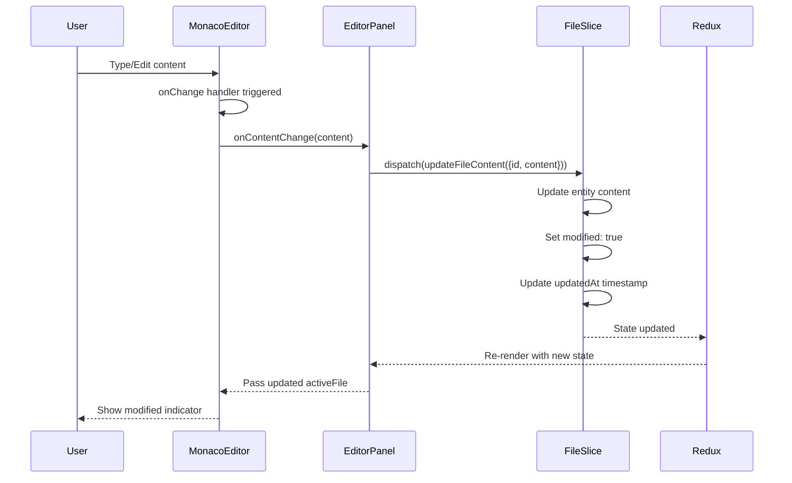
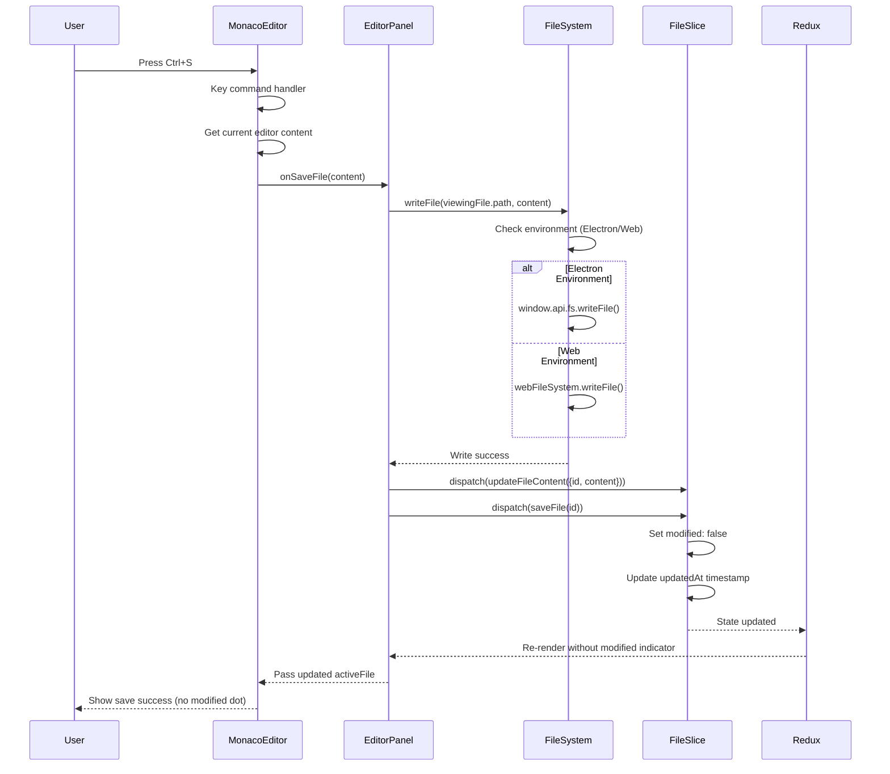
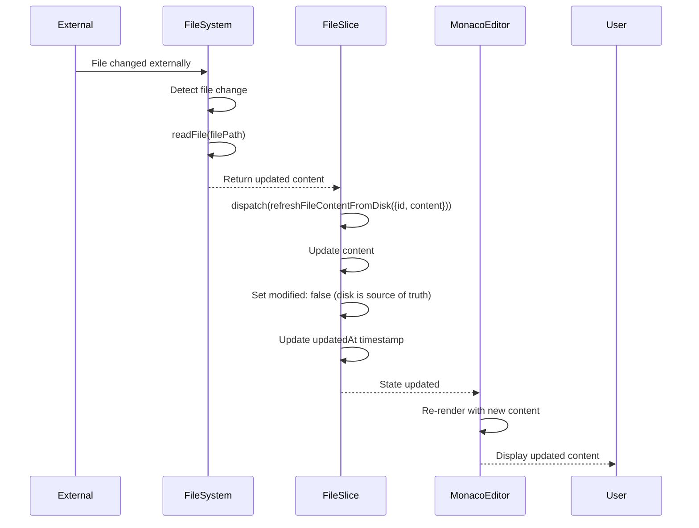
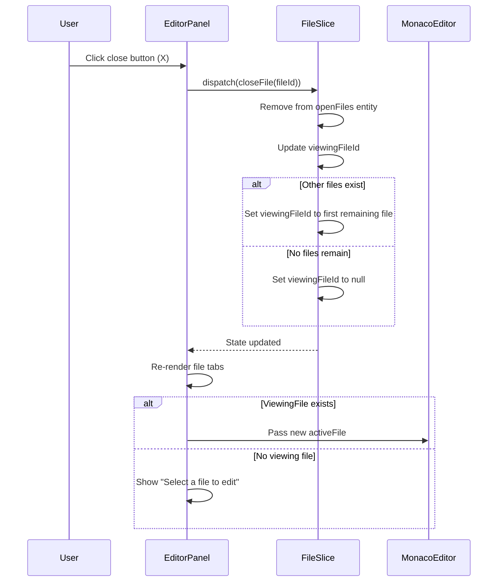

# File Editing Flow - Monaco Editor Integration

This document explains the file editing flow in tinyStudio using sequence diagrams. The application uses Monaco Editor for code editing with a unified file system abstraction and Redux for state management.

## Architecture Overview

The file editing system consists of three main components:

1. **File System Layer** (`fileSystem.ts`) - Unified abstraction for both Electron and web environments
2. **State Management** (`fileSlice.ts`) - Redux slice managing file state and operations
3. **Editor Panel** (`EditorPanel.tsx`) - Orchestrates file operations and content management
4. **Monaco Editor** (`MonacoEditor.tsx`) - Controlled component for code editing

## Key Design Principles

- **Separation of Concerns**: File operations are handled at the `EditorPanel` level, while `MonacoEditor` is a pure controlled component
- **Consistent State Management**: All file content changes flow through Redux state
- **Correct File Association**: Save operations are always performed on the currently viewing file
- **Extensible Architecture**: The same pattern can be used for `BlocklyEditor` and other future editors

## Sequence Diagrams

### 1. File Opening Flow



### 2. File Content Editing Flow



### 3. File Saving Flow (Ctrl+S)



### 4. File Refresh from Disk Flow



### 5. File Closing Flow



## Key Implementation Details

### File System Abstraction

The `fileSystem.ts` provides a unified API that works in both Electron and web environments:

```typescript
// Environment detection
const isElectron = (): boolean => {
  return typeof window !== 'undefined' && window.electron != null
}

// Unified file operations
async writeFile(filePath: string, content: string): Promise<void> {
  if (this.isElectron()) {
    await window.api.fs.writeFile(filePath, content)
  } else {
    await webFileSystem.writeFile(filePath, content)
  }
}
```

### Redux State Management

The `fileSlice.ts` uses Redux Toolkit's `createEntityAdapter` for efficient file management:

```typescript
// Entity adapter for normalized file state
const editorObjectAdapter = createEntityAdapter<EditorFile>()

// Efficient file updates
updateFileContent: create.reducer(
  (state, payload: PayloadAction<{ id: string; content: string }>) => {
    const { id, content } = payload.payload
    state.openFiles = editorObjectAdapter.updateOne(state.openFiles, {
      id,
      changes: {
        content,
        modified: content !== existingFile.content,
        updatedAt: new Date().toISOString()
      }
    })
  }
)
```

### EditorPanel Integration

The `EditorPanel.tsx` component now orchestrates all file operations:

```typescript
// Content change handler - updates Redux state
const handleContentChange = useCallback(
  (content: string) => {
    if (viewingFile) {
      dispatch(updateFileContent({ id: viewingFile.id, content }))
    }
  },
  [viewingFile, dispatch]
)

// Save handler - writes to file system and updates state
const handleSaveFile = useCallback(
  async (content: string) => {
    if (viewingFile?.path) {
      try {
        await fileSystem.writeFile(viewingFile.path, content)
        dispatch(updateFileContent({ id: viewingFile.id, content }))
        dispatch(saveFile(viewingFile.id))
      } catch (error) {
        console.error('Failed to save file:', error)
      }
    }
  },
  [viewingFile, dispatch]
)
```

### Monaco Editor as Controlled Component

The `MonacoEditor.tsx` component is now a pure controlled component:

```typescript
interface MonacoEditorProps {
  activeFile: EditorFile
  onContentChange: (content: string) => void
  onSaveFile: (content: string) => Promise<void>
}

// Simple content change handler
const handleContentChange = (value: string | undefined): void => {
  if (value !== undefined) {
    onContentChange(value)
  }
}

// Save command uses callback prop
editor.addCommand(monaco.KeyMod.CtrlCmd | monaco.KeyCode.KeyS, () => {
  const currentContent = editor.getValue() || ''
  onSaveFile(currentContent)
})
```

## Error Handling

The system includes comprehensive error handling:

1. **File System Errors** - Wrapped in try-catch blocks with user-friendly error messages
2. **State Consistency** - Entity adapter ensures normalized state structure
3. **Environment Fallbacks** - Graceful degradation between Electron and web environments

## Performance Considerations

1. **Debounced Updates** - Content changes are efficiently batched through Redux
2. **Normalized State** - Entity adapter provides O(1) lookups for file operations
3. **Lazy Loading** - Files are only loaded when opened, not preloaded
4. **Memory Management** - Files are properly cleaned up when closed

## Recent Improvements

### Fixed File Association Bug

- **Problem**: When multiple files were open, saving would write the content from the Monaco editor to the wrong file path
- **Solution**: Moved file operations to the `EditorPanel` level, ensuring saves always target the currently viewing file
- **Benefit**: Eliminates cross-file content corruption and ensures proper file association

### Improved Architecture

- **Separation of Concerns**: `MonacoEditor` is now a pure controlled component
- **Centralized File Operations**: All file I/O is handled at the `EditorPanel` level
- **Extensible Design**: The same pattern can be applied to `BlocklyEditor` and future editors
- **Better State Management**: Clear data flow from UI events to Redux actions

This architecture provides a robust, scalable file editing system that works consistently across different environments while maintaining good performance and user experience.
